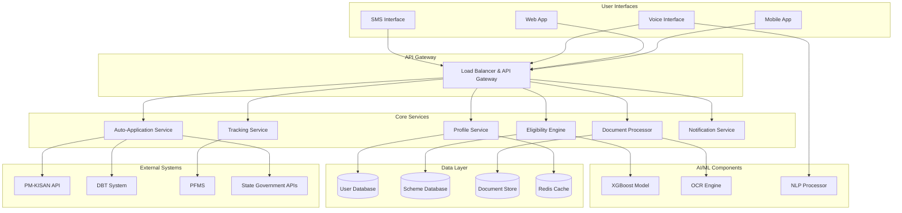

# Design Document: SarvaSahay Platform

## Overview

SarvaSahay is an AI-powered government scheme eligibility and enrollment platform designed to bridge the information gap between rural Indian citizens and government benefits. The system uses machine learning to match user profiles against complex eligibility criteria, automates document processing and form submission, and provides real-time tracking of applications through government systems.

The platform addresses the critical problem where eligible citizens miss ₹50,000-500,000 in annual benefits due to information barriers, complex eligibility rules, and bureaucratic friction. By leveraging AI for eligibility matching, OCR for document processing, and API integration with government systems, SarvaSahay transforms the citizen experience from months of uncertainty to instant discovery and automated enrollment.

## Architecture

### High-Level Architecture



### Service Architecture Pattern

The system follows a microservices architecture with the following principles:
- **Domain-driven design**: Each service owns a specific business domain
- **Event-driven communication**: Services communicate via events for loose coupling
- **API-first design**: All services expose REST APIs with OpenAPI specifications
- **Stateless services**: All business logic is stateless for horizontal scaling
- **Centralized configuration**: Environment-specific configuration managed centrally

## Components and Interfaces

### 1. Profile Service

**Responsibility**: Manages user profile creation, updates, and validation

**Key Functions**:
- Multi-channel profile creation (SMS, voice, web)
- Profile validation and data quality checks
- Secure storage with encryption
- Profile versioning for audit trails

**API Endpoints**:
```
POST /api/v1/profiles - Create new profile
PUT /api/v1/profiles/{id} - Update profile
GET /api/v1/profiles/{id} - Retrieve profile
DELETE /api/v1/profiles/{id} - Delete profile (GDPR compliance)
```

**Data Model**:
```json
{
  "profileId": "string",
  "demographics": {
    "age": "number",
    "gender": "string",
    "caste": "string",
    "maritalStatus": "string"
  },
  "economic": {
    "annualIncome": "number",
    "landOwnership": "number",
    "employmentStatus": "string"
  },
  "location": {
    "state": "string",
    "district": "string",
    "block": "string",
    "village": "string"
  },
  "family": {
    "size": "number",
    "dependents": "number"
  },
  "createdAt": "timestamp",
  "updatedAt": "timestamp"
}
```

### 2. Eligibility Engine

**Responsibility**: AI-powered matching of user profiles against government scheme criteria

**Key Functions**:
- Real-time eligibility evaluation using XGBoost models
- Scheme ranking by benefit amount and approval probability
- Rule engine for complex interdependent criteria
- Model retraining pipeline for rule updates

**Technical Implementation**:
- **Algorithm**: XGBoost (Extreme Gradient Boosting) chosen for 89% accuracy and explainability
- **Features**: 50+ engineered features from user profile and scheme metadata
- **Training Data**: 2,000+ historical applications with outcomes
- **Inference Time**: <1 second for 30+ schemes evaluation
- **Model Updates**: Quarterly retraining with new government rule changes

**API Endpoints**:
```
POST /api/v1/eligibility/evaluate - Evaluate eligibility for user
GET /api/v1/eligibility/schemes/{userId} - Get eligible schemes
POST /api/v1/eligibility/retrain - Trigger model retraining
```

### 3. Document Processor

**Responsibility**: OCR-based document extraction and validation

**Key Functions**:
- Multi-format document processing (Aadhaar, PAN, land records, bank passbook)
- Text extraction using Tesseract OCR with preprocessing
- Data validation against user profile
- Document quality assessment and improvement suggestions

**Technical Implementation**:
- **OCR Engine**: Tesseract 5.0 with custom Indian language models
- **Preprocessing**: OpenCV for image enhancement, noise reduction, perspective correction
- **Validation**: Cross-reference extracted data with profile information
- **Storage**: Encrypted document metadata only (raw images deleted after processing)

**API Endpoints**:
```
POST /api/v1/documents/upload - Upload and process document
GET /api/v1/documents/{userId} - Get processed document data
POST /api/v1/documents/validate - Validate document against profile
```

### 4. Auto-Application Service

**Responsibility**: Automated form filling and submission to government portals

**Key Functions**:
- Form template management for 30+ government schemes
- Auto-population using profile and document data
- Direct API integration with government systems
- Fallback mechanisms for API failures

**Government API Integration**:
- **PM-KISAN**: Direct integration with farmer registration API
- **DBT System**: Integration with Direct Benefit Transfer portal
- **PFMS**: Public Financial Management System for payment tracking
- **State APIs**: Maharashtra, Karnataka, Tamil Nadu government portals

**API Endpoints**:
```
POST /api/v1/applications/create - Create application for schemes
POST /api/v1/applications/submit - Submit to government systems
GET /api/v1/applications/{userId} - Get user applications
```

### 5. Tracking Service

**Responsibility**: Real-time monitoring of application status across government systems

**Key Functions**:
- Periodic polling of government APIs for status updates
- Event-driven notifications for status changes
- Predictive analytics for approval timelines
- Integration with PFMS for payment confirmation

**API Endpoints**:
```
GET /api/v1/tracking/status/{applicationId} - Get application status
POST /api/v1/tracking/webhook - Receive government system webhooks
GET /api/v1/tracking/predictions/{applicationId} - Get approval predictions
```

### 6. Notification Service

**Responsibility**: Multi-channel communication with users

**Key Functions**:
- SMS notifications via telecom APIs
- Voice call integration for non-literate users
- Push notifications for mobile app users
- Email notifications for web users

**API Endpoints**:
```
POST /api/v1/notifications/send - Send notification
GET /api/v1/notifications/preferences/{userId} - Get user preferences
PUT /api/v1/notifications/preferences/{userId} - Update preferences
```

## Data Models

### User Profile Schema
```json
{
  "profileId": "uuid",
  "personalInfo": {
    "name": "string",
    "age": "integer",
    "gender": "enum[male,female,other]",
    "caste": "enum[general,obc,sc,st]",
    "maritalStatus": "enum[single,married,widowed,divorced]"
  },
  "economicInfo": {
    "annualIncome": "decimal",
    "landOwnership": "decimal",
    "employmentStatus": "enum[farmer,laborer,self_employed,unemployed]",
    "bankAccount": "string"
  },
  "locationInfo": {
    "state": "string",
    "district": "string",
    "block": "string",
    "village": "string",
    "pincode": "string"
  },
  "familyInfo": {
    "familySize": "integer",
    "dependents": "integer",
    "elderlyMembers": "integer"
  },
  "documents": {
    "aadhaar": "string",
    "pan": "string",
    "bankPassbook": "string",
    "landRecords": "string"
  },
  "preferences": {
    "language": "enum[hindi,marathi,tamil,bengali]",
    "communicationChannel": "enum[sms,voice,app]"
  },
  "metadata": {
    "createdAt": "timestamp",
    "updatedAt": "timestamp",
    "version": "integer"
  }
}
```

### Government Scheme Schema
```json
{
  "schemeId": "uuid",
  "basicInfo": {
    "name": "string",
    "description": "string",
    "ministry": "string",
    "launchDate": "date",
    "status": "enum[active,inactive,suspended]"
  },
  "eligibility": {
    "ageRange": {"min": "integer", "max": "integer"},
    "genderRestriction": "enum[any,male,female]",
    "casteRestriction": "array[string]",
    "incomeLimit": "decimal",
    "landOwnershipLimit": "decimal",
    "locationRestriction": "array[string]"
  },
  "benefits": {
    "type": "enum[cash,subsidy,loan,insurance]",
    "amount": "decimal",
    "frequency": "enum[one_time,monthly,quarterly,yearly]",
    "duration": "integer"
  },
  "application": {
    "formTemplate": "string",
    "requiredDocuments": "array[string]",
    "apiEndpoint": "string",
    "processingTime": "integer"
  },
  "metadata": {
    "lastUpdated": "timestamp",
    "version": "integer"
  }
}
```

### Application Schema
```json
{
  "applicationId": "uuid",
  "userId": "uuid",
  "schemeId": "uuid",
  "applicationData": {
    "formData": "object",
    "submittedDocuments": "array[string]",
    "governmentRefNumber": "string"
  },
  "status": {
    "current": "enum[draft,submitted,under_review,approved,rejected,paid]",
    "history": "array[object]",
    "lastUpdated": "timestamp"
  },
  "predictions": {
    "approvalProbability": "decimal",
    "expectedProcessingTime": "integer",
    "suggestedImprovements": "array[string]"
  },
  "metadata": {
    "createdAt": "timestamp",
    "submittedAt": "timestamp",
    "completedAt": "timestamp"
  }
}
```

## Correctness Properties

*A property is a characteristic or behavior that should hold true across all valid executions of a system—essentially, a formal statement about what the system should do. Properties serve as the bridge between human-readable specifications and machine-verifiable correctness guarantees.*

Based on the requirements analysis, the following correctness properties ensure the SarvaSahay platform operates correctly across all scenarios:

### Property 1: Profile Data Completeness and Security
*For any* user profile creation or update, the system should collect all required demographic fields (age, gender, caste, income, land ownership, employment, family details), store the data with encryption, and automatically trigger eligibility re-evaluation.
**Validates: Requirements 1.2, 1.4, 1.5**

### Property 2: Eligibility Engine Performance and Accuracy
*For any* user profile, the eligibility engine should evaluate against all 30+ government schemes within 5 seconds, apply all 1000+ eligibility rules including interdependencies, and rank results by benefit amount and approval probability.
**Validates: Requirements 2.1, 2.2, 2.3**

### Property 3: Document Processing Round-Trip Integrity
*For any* uploaded document, the OCR system should extract text, validate against user profile, flag inconsistencies, and store extracted data for reuse, ensuring that processed data accurately represents the original document content.
**Validates: Requirements 3.1, 3.2, 3.3, 3.4**

### Property 4: Auto-Application Workflow Completeness
*For any* selected government scheme, the system should pre-fill forms using profile and document data, present for user review, submit via official APIs upon approval, and provide reference numbers with confirmation details.
**Validates: Requirements 4.1, 4.2, 4.3, 4.5**

### Property 5: Real-Time Tracking and Notification Consistency
*For any* submitted application, the tracking system should monitor status through government databases, send SMS notifications on status changes, notify users of approvals with payment details, and confirm disbursements.
**Validates: Requirements 5.1, 5.2, 5.3, 5.4**

### Property 6: Multi-Channel Interface Language Support
*For any* user interaction channel (SMS, voice, web), the system should provide navigation and communication in the user's preferred local language (Marathi, Hindi, regional languages).
**Validates: Requirements 6.1, 6.2, 6.5**

### Property 7: Outcome Learning and Model Improvement
*For any* application outcome, the system should track approval rates, rejection reasons, and processing times, then use this data to retrain models and improve eligibility predictions quarterly.
**Validates: Requirements 7.1, 7.2, 7.3, 7.5**

### Property 8: Government API Integration Compliance
*For any* application submission, the system should use only official government APIs (PM-KISAN, DBT, PFMS), maintain audit trails, comply with data privacy regulations, and adapt to API changes within 48 hours.
**Validates: Requirements 8.1, 8.2, 8.3, 8.4**

### Property 9: Performance Under Scale
*For any* system load condition, eligibility checks should complete within 5 seconds, document processing should handle concurrent uploads without degradation, and the system should maintain 99.5% uptime during business hours.
**Validates: Requirements 9.1, 9.2, 9.5**

### Property 10: Security and Privacy Protection
*For any* user data operation, the system should encrypt personal information using industry standards, delete raw document images after processing, require multi-factor authentication for admin access, and process data deletion requests within 30 days.
**Validates: Requirements 10.1, 10.2, 10.3, 10.5**

### Property 11: Error Handling and Fallback Mechanisms
*For any* system failure scenario (API unavailable, poor document quality, processing delays), the system should provide alternative methods, specific guidance for improvement, and appropriate alerts with suggested actions.
**Validates: Requirements 3.5, 4.4, 5.5**

## Error Handling

### Error Categories and Responses

**1. User Input Errors**
- **Invalid Profile Data**: Validate input ranges and provide specific error messages
- **Poor Document Quality**: Use image quality assessment to request clearer photos with guidance
- **Incomplete Information**: Guide users through missing required fields

**2. System Integration Errors**
- **Government API Failures**: Implement circuit breaker pattern with exponential backoff
- **Database Connectivity Issues**: Use connection pooling with automatic retry mechanisms
- **OCR Processing Failures**: Fallback to manual document review workflow

**3. Performance Degradation**
- **High Load Conditions**: Implement request queuing with priority for critical functions
- **Resource Constraints**: Auto-scaling with load balancing across multiple instances
- **Timeout Scenarios**: Graceful degradation with partial results when possible

**4. Security Incidents**
- **Suspicious Activity Detection**: Immediate account freezing with user notification
- **Data Breach Attempts**: Automated security response with audit logging
- **Authentication Failures**: Progressive delays with account lockout mechanisms

### Recovery Strategies

**Graceful Degradation**:
- Eligibility matching continues with cached scheme data if real-time updates fail
- SMS notifications use backup gateway providers if primary service is unavailable
- Document processing falls back to manual review if OCR confidence is low

**Data Consistency**:
- All database operations use transactions with rollback capabilities
- Event sourcing for critical state changes with replay mechanisms
- Regular data backups with point-in-time recovery options

## Testing Strategy

### Dual Testing Approach

The SarvaSahay platform requires both unit testing and property-based testing to ensure comprehensive coverage:

**Unit Tests**: Verify specific examples, edge cases, and error conditions
- Integration points between microservices
- Government API response handling
- Document processing edge cases (blurry images, missing fields)
- SMS/voice interface specific scenarios

**Property Tests**: Verify universal properties across all inputs
- Eligibility matching accuracy across diverse user profiles
- Document processing consistency across various document types
- Performance characteristics under different load conditions
- Security properties across all data operations

### Property-Based Testing Configuration

**Testing Framework**: Use Hypothesis (Python) for property-based testing with minimum 100 iterations per property test.

**Test Tagging**: Each property test must reference its design document property using the format:
```python
# Feature: sarvasahay-platform, Property 1: Profile Data Completeness and Security
```

**Coverage Requirements**:
- Each correctness property must be implemented by a single property-based test
- Property tests should generate diverse input scenarios automatically
- Unit tests should focus on specific integration points and error conditions

### Test Data Strategy

**Synthetic Data Generation**:
- Generate realistic user profiles covering all demographic combinations
- Create synthetic government scheme data with various eligibility criteria
- Generate document images with controlled quality variations

**Government Data Integration**:
- Use anonymized historical application data for model training validation
- Test against real government API endpoints in staging environment
- Validate against official scheme eligibility criteria

### Performance Testing

**Load Testing Scenarios**:
- 1,000 concurrent users creating profiles
- 10,000 simultaneous eligibility evaluations
- 500 concurrent document uploads with OCR processing

**Scalability Validation**:
- Horizontal scaling verification under increasing load
- Database performance under high transaction volumes
- API response time consistency across different load levels

### Security Testing

**Penetration Testing**:
- Authentication and authorization bypass attempts
- Data injection and extraction attempts
- API security validation against OWASP top 10

**Privacy Compliance Testing**:
- Data encryption verification at rest and in transit
- GDPR compliance for data deletion requests
- Audit trail completeness and integrity