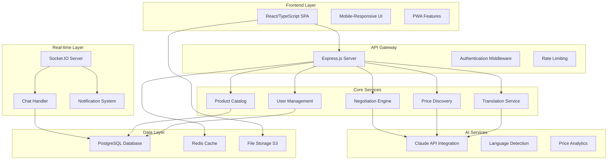

# Design Document: TradeLink Marketplace

## Overview

TradeLink is a comprehensive AI-powered marketplace platform built with React/TypeScript frontend and Node.js/Express backend. The system integrates real-time multilingual communication, AI-driven price negotiation, and location-based product discovery to create a seamless trading experience for vendors and buyers across language barriers.

The platform follows a microservices-inspired architecture with clear separation between frontend presentation, backend API services, real-time communication, and AI processing components.

## Architecture

### System Architecture Diagram



### Technology Stack

**Frontend:**
- React 18 with TypeScript
- Zustand for state management
- Socket.IO client for real-time features
- Tailwind CSS for styling
- React Query for API state management
- Framer Motion for animations

**Backend:**
- Node.js with Express.js
- Socket.IO for WebSocket connections
- PostgreSQL with PostGIS for geospatial queries
- Redis for caching and session management
- Anthropic Claude API for AI features

**Infrastructure:**
- AWS S3 for file storage
- Vercel for frontend deployment
- Railway for backend deployment
- Supabase for managed PostgreSQL

## Components and Interfaces

### Frontend Component Architecture

```typescript
// Core component interfaces
interface User {
  id: string;
  email: string;
  fullName: string;
  role: 'buyer' | 'vendor';
  preferredLanguage: string;
  location: {
    city: string;
    country: string;
    coordinates: [number, number];
  };
}

interface Product {
  id: string;
  vendorId: string;
  name: Record<string, string>; // Multilingual names
  description: Record<string, string>;
  category: string;
  basePrice: number;
  currency: string;
  unit: string;
  quantityAvailable: number;
  images: string[];
  attributes: Record<string, any>;
  isActive: boolean;
}

interface Negotiation {
  id: string;
  productId: string;
  buyerId: string;
  vendorId: string;
  status: 'active' | 'accepted' | 'rejected' | 'expired';
  initialPrice: number;
  currentOffer: number;
  finalPrice?: number;
  buyerLanguage: string;
  vendorLanguage: string;
  expiresAt: Date;
}

interface Message {
  id: string;
  negotiationId: string;
  senderId: string;
  originalText: string;
  originalLanguage: string;
  translations: Record<string, string>;
  messageType: 'text' | 'offer' | 'counter_offer' | 'acceptance';
  priceOffer?: number;
  createdAt: Date;
}
```

### Key React Components

**ProductCard Component:**
```typescript
interface ProductCardProps {
  product: Product;
  userLanguage: string;
  onAddToCart: (id: string, quantity: number) => void;
  onStartNegotiation: (productId: string) => void;
}

export const ProductCard: React.FC<ProductCardProps> = ({
  product,
  userLanguage,
  onAddToCart,
  onStartNegotiation
}) => {
  // Component implementation with quantity selector,
  // multilingual display, and negotiation trigger
};
```

**ChatWindow Component:**
```typescript
interface ChatWindowProps {
  negotiationId: string;
  userLanguage: string;
  recipientLanguage: string;
  onPriceOffer: (amount: number) => void;
}

export const ChatWindow: React.FC<ChatWindowProps> = ({
  negotiationId,
  userLanguage,
  recipientLanguage,
  onPriceOffer
}) => {
  // Real-time chat with translation and price negotiation
};
```

### Backend API Interfaces

**Product Service:**
```typescript
interface ProductService {
  createProduct(vendorId: string, productData: CreateProductRequest): Promise<Product>;
  getProducts(filters: ProductFilters): Promise<Product[]>;
  getProductById(id: string, language: string): Promise<Product>;
  updateProduct(id: string, updates: Partial<Product>): Promise<Product>;
  deleteProduct(id: string): Promise<void>;
  searchProducts(query: string, language: string, location?: [number, number]): Promise<Product[]>;
}

interface CreateProductRequest {
  name: Record<string, string>;
  description: Record<string, string>;
  category: string;
  basePrice: number;
  currency: string;
  unit: string;
  quantityAvailable: number;
  images: string[];
  attributes: Record<string, any>;
}

interface ProductFilters {
  category?: string;
  location?: [number, number];
  radius?: number; // in kilometers
  language: string;
  minPrice?: number;
  maxPrice?: number;
  vendorId?: string;
}
```

**Translation Service:**
```typescript
interface TranslationService {
  translateText(
    text: string,
    fromLanguage: string,
    toLanguage: string,
    context?: TranslationContext
  ): Promise<string>;
  
  detectLanguage(text: string): Promise<string>;
  
  bulkTranslate(
    texts: string[],
    fromLanguage: string,
    toLanguages: string[]
  ): Promise<BulkTranslationResult>;
}

interface TranslationContext {
  type: 'product' | 'negotiation' | 'general';
  productName?: string;
  negotiationId?: string;
}

interface BulkTranslationResult {
  translations: Array<{
    original: string;
    translations: Record<string, string>;
  }>;
}
```

**Negotiation Service:**
```typescript
interface NegotiationService {
  startNegotiation(request: StartNegotiationRequest): Promise<Negotiation>;
  respondToNegotiation(
    negotiationId: string,
    userId: string,
    response: NegotiationResponse
  ): Promise<Negotiation>;
  getNegotiationHistory(negotiationId: string): Promise<Message[]>;
  suggestCounterOffer(negotiationId: string): Promise<CounterOfferSuggestion>;
}

interface StartNegotiationRequest {
  productId: string;
  buyerId: string;
  initialOffer: number;
  message: string;
  buyerLanguage: string;
}

interface NegotiationResponse {
  action: 'accept' | 'reject' | 'counter';
  counterOffer?: number;
  message?: string;
}

interface CounterOfferSuggestion {
  suggestedPrice: number;
  messageTemplate: string;
  acceptanceProbability: number;
  rationale: string;
  alternativeSuggestions: string[];
}
```

## Data Models

### Database Schema

**Users Table:**
```sql
CREATE TABLE users (
  id UUID PRIMARY KEY DEFAULT gen_random_uuid(),
  email VARCHAR(255) UNIQUE NOT NULL,
  password_hash VARCHAR(255) NOT NULL,
  full_name VARCHAR(255) NOT NULL,
  phone VARCHAR(50),
  role VARCHAR(20) CHECK (role IN ('buyer', 'vendor', 'admin')),
  preferred_language VARCHAR(10) DEFAULT 'en',
  location JSONB, -- {city, country, coordinates}
  created_at TIMESTAMP DEFAULT NOW(),
  updated_at TIMESTAMP DEFAULT NOW()
);
```

**Vendors Table:**
```sql
CREATE TABLE vendors (
  id UUID PRIMARY KEY DEFAULT gen_random_uuid(),
  user_id UUID REFERENCES users(id) ON DELETE CASCADE,
  business_name JSONB NOT NULL, -- {"en": "Shop Name", "hi": "दुकान का नाम"}
  description JSONB,
  address TEXT,
  location POINT, -- PostGIS for geospatial queries
  languages TEXT[], -- ['en', 'hi', 'es']
  verified BOOLEAN DEFAULT false,
  rating DECIMAL(3,2) DEFAULT 0.00,
  total_sales INTEGER DEFAULT 0,
  avatar_url TEXT,
  banner_url TEXT,
  created_at TIMESTAMP DEFAULT NOW()
);
```

**Products Table:**
```sql
CREATE TABLE products (
  id UUID PRIMARY KEY DEFAULT gen_random_uuid(),
  vendor_id UUID REFERENCES vendors(id) ON DELETE CASCADE,
  name JSONB NOT NULL, -- {"en": "Tomatoes", "hi": "टमाटर"}
  description JSONB,
  category VARCHAR(100) NOT NULL,
  subcategory VARCHAR(100),
  base_price DECIMAL(10,2) NOT NULL,
  currency VARCHAR(3) DEFAULT 'USD',
  unit VARCHAR(50), -- 'kg', 'lb', 'piece', etc.
  quantity_available INTEGER,
  images TEXT[],
  attributes JSONB, -- {color: 'red', organic: true}
  is_active BOOLEAN DEFAULT true,
  created_at TIMESTAMP DEFAULT NOW(),
  updated_at TIMESTAMP DEFAULT NOW()
);
```

**Negotiations Table:**
```sql
CREATE TABLE negotiations (
  id UUID PRIMARY KEY DEFAULT gen_random_uuid(),
  product_id UUID REFERENCES products(id),
  buyer_id UUID REFERENCES users(id),
  vendor_id UUID REFERENCES vendors(id),
  status VARCHAR(20) CHECK (status IN ('active', 'accepted', 'rejected', 'expired')),
  initial_price DECIMAL(10,2) NOT NULL,
  current_offer DECIMAL(10,2),
  final_price DECIMAL(10,2),
  buyer_language VARCHAR(10),
  vendor_language VARCHAR(10),
  expires_at TIMESTAMP,
  created_at TIMESTAMP DEFAULT NOW(),
  updated_at TIMESTAMP DEFAULT NOW()
);
```

**Messages Table:**
```sql
CREATE TABLE messages (
  id UUID PRIMARY KEY DEFAULT gen_random_uuid(),
  negotiation_id UUID REFERENCES negotiations(id) ON DELETE CASCADE,
  sender_id UUID REFERENCES users(id),
  original_text TEXT NOT NULL,
  original_language VARCHAR(10) NOT NULL,
  translations JSONB, -- {"en": "Hello", "hi": "नमस्ते"}
  message_type VARCHAR(20) DEFAULT 'text',
  price_offer DECIMAL(10,2),
  created_at TIMESTAMP DEFAULT NOW()
);
```

### Data Access Patterns

**Product Search with Location:**
```sql
-- Find products within 10km radius, ordered by distance
SELECT p.*, v.business_name, v.location,
       ST_Distance(v.location, ST_Point($longitude, $latitude)) as distance
FROM products p
JOIN vendors v ON p.vendor_id = v.id
WHERE ST_DWithin(v.location, ST_Point($longitude, $latitude), 10000)
  AND p.category = $category
  AND p.is_active = true
ORDER BY distance ASC
LIMIT 20;
```

**Multilingual Product Search:**
```sql
-- Search products with multilingual name matching
SELECT p.*, v.business_name
FROM products p
JOIN vendors v ON p.vendor_id = v.id
WHERE (p.name->>'en' ILIKE '%' || $query || '%'
   OR p.name->>'hi' ILIKE '%' || $query || '%'
   OR p.name->>'es' ILIKE '%' || $query || '%')
  AND p.is_active = true;
```

## AI Integration Architecture

### Claude API Integration

**Translation Service Implementation:**
```typescript
class ClaudeTranslationService implements TranslationService {
  private anthropic: Anthropic;
  
  constructor(apiKey: string) {
    this.anthropic = new Anthropic({ apiKey });
  }
  
  async translateText(
    text: string,
    fromLanguage: string,
    toLanguage: string,
    context?: TranslationContext
  ): Promise<string> {
    const contextInfo = this.buildContextPrompt(context);
    
    const prompt = `Translate the following message from ${fromLanguage} to ${toLanguage}.
    
${contextInfo}
Maintain a professional yet friendly marketplace tone. Preserve any prices, numbers, or measurements exactly.

Message: "${text}"

Provide ONLY the translation, no explanation or preamble.`;

    const response = await this.anthropic.messages.create({
      model: 'claude-3-sonnet-20240229',
      max_tokens: 500,
      messages: [{ role: 'user', content: prompt }]
    });
    
    return response.content[0].text.trim();
  }
  
  private buildContextPrompt(context?: TranslationContext): string {
    if (!context) return 'This is a marketplace conversation between a buyer and vendor.';
    
    switch (context.type) {
      case 'product':
        return `This message is about "${context.productName}" in a product inquiry.`;
      case 'negotiation':
        return `This message is part of a price negotiation.`;
      default:
        return 'This is a marketplace conversation between a buyer and vendor.';
    }
  }
}
```

**Price Discovery Service:**
```typescript
class PriceDiscoveryService {
  private anthropic: Anthropic;
  
  async analyzePricing(
    productData: Product,
    marketData: MarketData
  ): Promise<PriceAnalysis> {
    const prompt = `You are a pricing analyst for a local marketplace platform. Analyze the following data and provide pricing recommendations.

PRODUCT INFORMATION:
- Name: ${productData.name.en}
- Category: ${productData.category}
- Current Listed Price: $${productData.basePrice}
- Unit: ${productData.unit}

MARKET DATA:
- Competitor Prices: ${JSON.stringify(marketData.competitorPrices)}
- Historical Sales: ${JSON.stringify(marketData.historicalSales)}
- Local Average: $${marketData.localAverage}
- Seasonal Demand: ${marketData.seasonality}

Please provide a JSON response with:
1. recommended_price: Optimal price point
2. min_price: Minimum acceptable price (vendor's bottom line)
3. max_price: Maximum market price
4. confidence_score: How confident you are (0-100)
5. reasoning: Brief explanation
6. negotiation_range: Suggested range for negotiations

Format as JSON only, no markdown.`;

    const response = await this.anthropic.messages.create({
      model: 'claude-3-sonnet-20240229',
      max_tokens: 1000,
      messages: [{ role: 'user', content: prompt }]
    });
    
    const jsonText = response.content[0].text
      .replace(/```json\n?/g, '')
      .replace(/```\n?/g, '')
      .trim();
    
    return JSON.parse(jsonText);
  }
}
```

### Real-time Communication Architecture

**WebSocket Handler:**
```typescript
class ChatHandler {
  private io: Server;
  private translationService: TranslationService;
  
  constructor(io: Server, translationService: TranslationService) {
    this.io = io;
    this.translationService = translationService;
    this.setupEventHandlers();
  }
  
  private setupEventHandlers(): void {
    this.io.on('connection', (socket) => {
      socket.on('join-negotiation', async (negotiationId: string) => {
        socket.join(`negotiation-${negotiationId}`);
        const history = await this.getNegotiationHistory(negotiationId);
        socket.emit('negotiation-history', history);
      });
      
      socket.on('send-message', async (data: SendMessageData) => {
        await this.handleMessage(socket, data);
      });
      
      socket.on('price-offer', async (data: PriceOfferData) => {
        await this.handlePriceOffer(socket, data);
      });
    });
  }
  
  private async handleMessage(socket: Socket, data: SendMessageData): Promise<void> {
    try {
      const { negotiationId, text, targetLanguage, context } = data;
      
      // Detect sender's language
      const senderLanguage = await this.translationService.detectLanguage(text);
      
      // Translate message
      const translation = await this.translationService.translateText(
        text,
        senderLanguage,
        targetLanguage,
        context
      );
      
      // Save to database
      const message = await this.saveMessage({
        negotiationId,
        senderId: socket.userId,
        originalText: text,
        originalLanguage: senderLanguage,
        translations: { [targetLanguage]: translation }
      });
      
      // Broadcast to negotiation room
      this.io.to(`negotiation-${negotiationId}`).emit('new-message', {
        id: message.id,
        senderId: socket.userId,
        text: text,
        originalLanguage: senderLanguage,
        translations: { [targetLanguage]: translation },
        timestamp: message.createdAt,
        priceOffer: data.priceOffer || null
      });
      
    } catch (error) {
      socket.emit('message-error', { error: error.message });
    }
  }
}
```

## Correctness Properties

*A property is a characteristic or behavior that should hold true across all valid executions of a system-essentially, a formal statement about what the system should do. Properties serve as the bridge between human-readable specifications and machine-verifiable correctness guarantees.*

### Property Reflection

After analyzing all acceptance criteria, several properties can be consolidated to eliminate redundancy:

- User authentication and session management properties can be combined into comprehensive authentication behavior
- Multilingual display properties across different components can be unified into general localization behavior
- Location-based features share common distance calculation and filtering logic
- Translation properties can be consolidated around translation accuracy and fallback behavior
- Price-related properties can be grouped around pricing analysis and negotiation assistance

### Core Properties

**Property 1: Authentication and Authorization Consistency**
*For any* user with valid credentials, authentication should succeed and establish appropriate role-based permissions, while invalid credentials should be consistently rejected across all authentication attempts.
**Validates: Requirements 1.1, 1.2, 1.3**

**Property 2: Multilingual Content Round-trip**
*For any* content stored in the system (products, profiles, messages), storing content in one language and retrieving it should preserve the original content, and automatic translations should be generated when requested languages are not available.
**Validates: Requirements 2.1, 2.2, 2.3, 2.4, 2.5, 3.1, 3.5**

**Property 3: Location-based Search Consistency**
*For any* search query with location parameters, results should be ordered by geographic proximity, distances should be accurately calculated, and filtering by radius should include only vendors within the specified range.
**Validates: Requirements 4.1, 4.2, 4.3, 4.4**

**Property 4: Real-time Translation Accuracy**
*For any* message sent in a chat conversation, the system should detect the source language, translate to the recipient's preferred language, and maintain conversation context while handling translation failures gracefully.
**Validates: Requirements 5.1, 5.2, 5.3, 5.4, 5.5**

**Property 5: Price Validation and Analysis**
*For any* product pricing operation, valid prices should be accepted with proper format validation, pricing analysis should provide market-based recommendations with clear reasoning, and negotiation assistance should be contextually appropriate.
**Validates: Requirements 3.3, 6.1, 6.2, 6.3, 8.1, 8.2, 8.3, 8.4, 8.5**

**Property 6: Transaction Integrity**
*For any* completed transaction, the system should create accurate transaction records, process payments securely, update inventory quantities correctly, and maintain data consistency throughout the transaction lifecycle.
**Validates: Requirements 9.1, 9.2, 9.3, 9.4, 9.5**

**Property 7: Voice Input Processing**
*For any* voice input operation, audio should be captured correctly, converted to text accurately in the user's language, and pricing information should be extracted and highlighted when present, with graceful error handling for recognition failures.
**Validates: Requirements 7.1, 7.2, 7.3, 7.4, 7.5**

**Property 8: Mobile Responsiveness**
*For any* mobile device interaction, the interface should adapt appropriately to screen size and touch input, provide native-like navigation, support camera/gallery image uploads, and handle offline scenarios with proper synchronization.
**Validates: Requirements 10.1, 10.2, 10.3, 10.4, 10.5**

**Property 9: Data Persistence and Updates**
*For any* data modification operation (user preferences, product listings, inventory updates), changes should be immediately reflected in the system, persisted correctly, and synchronized across all relevant components.
**Validates: Requirements 1.4, 1.5, 3.2, 3.4**

**Property 10: Negotiation Flow Integrity**
*For any* price negotiation, the system should facilitate proper conversation flow, provide AI-powered assistance to both parties, handle agreement completion correctly, and suggest compromise solutions when negotiations stall.
**Validates: Requirements 6.4, 6.5**

## Error Handling

### Error Categories and Strategies

**Authentication Errors:**
- Invalid credentials: Return standardized error messages without revealing user existence
- Session expiration: Redirect to login with clear messaging
- Permission denied: Return 403 with appropriate error details
- Rate limiting: Return 429 with retry-after headers

**Translation Errors:**
- API failures: Fall back to original text with error indicator
- Language detection failures: Default to English with user override option
- Context loss: Maintain conversation history for context recovery
- Timeout errors: Cache partial translations and retry

**Payment Processing Errors:**
- Payment gateway failures: Provide clear error messages and alternative payment methods
- Insufficient funds: Guide users to payment resolution options
- Currency conversion errors: Display errors with current exchange rates
- Transaction timeouts: Implement idempotent retry mechanisms

**File Upload Errors:**
- Size limits: Compress images automatically or provide clear size requirements
- Format validation: Accept common formats and provide conversion suggestions
- Storage failures: Implement retry logic with exponential backoff
- Malware detection: Quarantine files and notify users

**Network and Connectivity Errors:**
- WebSocket disconnections: Implement automatic reconnection with exponential backoff
- API timeouts: Provide loading states and retry options
- Offline scenarios: Cache critical data and sync when connectivity returns
- Partial data loading: Implement progressive loading with error boundaries

### Error Response Format

```typescript
interface ErrorResponse {
  success: false;
  error: {
    code: string;
    message: string;
    details?: Record<string, any>;
    timestamp: string;
    requestId: string;
  };
  retryable: boolean;
  retryAfter?: number;
}
```

### Logging and Monitoring

**Error Logging Strategy:**
- Client-side errors: Log to browser console and send to monitoring service
- Server-side errors: Log with structured format including request context
- Translation errors: Track accuracy metrics and failure patterns
- Performance errors: Monitor response times and resource usage

**Monitoring Dashboards:**
- Real-time error rates by endpoint and error type
- Translation accuracy and performance metrics
- Payment processing success rates
- WebSocket connection stability
- Mobile vs desktop error patterns

## Testing Strategy

### Dual Testing Approach

The TradeLink platform requires both unit testing and property-based testing to ensure comprehensive coverage:

**Unit Tests:**
- Focus on specific examples, edge cases, and error conditions
- Test individual components and functions in isolation
- Verify integration points between services
- Validate error handling and boundary conditions

**Property-Based Tests:**
- Verify universal properties across all inputs using randomized test data
- Test system behavior with generated user data, product catalogs, and negotiation scenarios
- Validate correctness properties with minimum 100 iterations per test
- Each property test must reference its corresponding design document property

### Testing Framework Selection

**Frontend Testing:**
- **Unit Tests:** Jest + React Testing Library
- **Property Tests:** fast-check for JavaScript property-based testing
- **Integration Tests:** Cypress for end-to-end testing
- **Visual Tests:** Storybook + Chromatic for component testing

**Backend Testing:**
- **Unit Tests:** Jest + Supertest for API testing
- **Property Tests:** fast-check for Node.js property-based testing
- **Database Tests:** Jest with test database containers
- **Load Tests:** Artillery for performance testing

### Property Test Configuration

Each property-based test must:
- Run minimum 100 iterations to ensure statistical significance
- Include a comment tag referencing the design property
- Use appropriate generators for realistic test data
- Handle edge cases through generator constraints

**Example Property Test Structure:**
```typescript
// Feature: tradelink-marketplace, Property 2: Multilingual Content Round-trip
describe('Multilingual Content Properties', () => {
  it('should preserve original content in round-trip operations', () => {
    fc.assert(fc.property(
      fc.record({
        name: fc.dictionary(fc.constantFrom('en', 'hi', 'es'), fc.string()),
        description: fc.dictionary(fc.constantFrom('en', 'hi', 'es'), fc.string()),
        category: fc.string()
      }),
      async (productData) => {
        const stored = await productService.createProduct(vendorId, productData);
        const retrieved = await productService.getProductById(stored.id, 'en');
        
        // Original content should be preserved
        expect(retrieved.name).toEqual(productData.name);
        expect(retrieved.description).toEqual(productData.description);
        
        // Translations should be available for missing languages
        const hindiVersion = await productService.getProductById(stored.id, 'hi');
        expect(hindiVersion.name.hi).toBeDefined();
      }
    ), { numRuns: 100 });
  });
});
```

### Test Data Generation

**User Data Generators:**
```typescript
const userGenerator = fc.record({
  email: fc.emailAddress(),
  fullName: fc.fullUnicodeString(5, 50),
  role: fc.constantFrom('buyer', 'vendor'),
  preferredLanguage: fc.constantFrom('en', 'hi', 'es', 'fr', 'ar'),
  location: fc.record({
    city: fc.string(3, 30),
    country: fc.string(2, 30),
    coordinates: fc.tuple(fc.float(-180, 180), fc.float(-90, 90))
  })
});
```

**Product Data Generators:**
```typescript
const productGenerator = fc.record({
  name: fc.dictionary(
    fc.constantFrom('en', 'hi', 'es'),
    fc.string(3, 100)
  ),
  category: fc.constantFrom('electronics', 'clothing', 'food', 'books'),
  basePrice: fc.float(0.01, 10000),
  currency: fc.constantFrom('USD', 'EUR', 'INR'),
  quantityAvailable: fc.integer(0, 1000)
});
```

**Negotiation Scenario Generators:**
```typescript
const negotiationGenerator = fc.record({
  initialPrice: fc.float(1, 1000),
  buyerLanguage: fc.constantFrom('en', 'hi', 'es'),
  vendorLanguage: fc.constantFrom('en', 'hi', 'es'),
  messages: fc.array(fc.record({
    text: fc.string(1, 500),
    priceOffer: fc.option(fc.float(1, 1000))
  }), 1, 20)
});
```

### Integration Testing Strategy

**API Integration Tests:**
- Test complete user registration and authentication flows
- Verify product creation, search, and retrieval workflows
- Test negotiation initiation and message exchange
- Validate payment processing and transaction completion

**WebSocket Integration Tests:**
- Test real-time chat functionality with multiple clients
- Verify message translation and delivery
- Test connection handling and reconnection scenarios
- Validate negotiation state synchronization

**Database Integration Tests:**
- Test complex queries with geospatial data
- Verify multilingual search functionality
- Test transaction isolation and consistency
- Validate data migration and schema changes

### Performance Testing Requirements

**Load Testing Scenarios:**
- Concurrent user registration and authentication
- High-volume product searches with location filtering
- Simultaneous chat conversations with translation
- Peak negotiation activity with AI assistance

**Performance Benchmarks:**
- API response times: < 200ms for 95th percentile
- Translation latency: < 500ms for typical messages
- WebSocket message delivery: < 100ms
- Database query performance: < 50ms for product searches
- Image upload processing: < 2 seconds for optimization

**Scalability Testing:**
- Test system behavior with 10,000+ concurrent users
- Validate database performance with 1M+ products
- Test translation service under high load
- Verify WebSocket server capacity limits